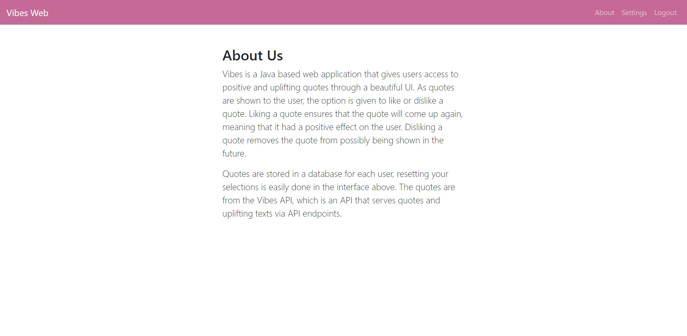

# Vibes Web

### Description

The Vibes Web uses many modern libraries and frameworks to create an amazing application that provides a positive quote reading experience for users looking for a mental boost. It uses [Vibes API](https://github.com/davidgrzyb/vibes-api) as the underlying source for positive quotes.

#### [View Screenshots](#screenshots)

### Libraries & Frameworks

- [Spring Boot](https://spring.io/projects/spring-boot) - an open source Java-based framework used to create a micro Service. It is developed by Pivotal Team and is used to build stand-alone and production ready spring applications.
- [Spring Security](https://spring.io/projects/spring-security) - a Java/Java EE framework that provides authentication, authorization and other security features for enterprise applications.
- [Spring Data JPA](https://spring.io/projects/spring-data-jpa) - makes it easy to easily implement JPA based repositories.
- [Hibernate](https://hibernate.org/) - an object-relational mapping tool for the Java programming language. It provides a framework for mapping an object-oriented domain model to a relational database.
- [Thymeleaf](https://www.thymeleaf.org/) - a Java XML/XHTML/HTML5 template engine that can work both in web and non-web environments.
- [Bootstrap](https://getbootstrap.com/) - a free and open-source CSS framework directed at responsive, mobile-first front-end web development.

### Database

- [MySql](https://www.mysql.com/) - an open-source relational database management system.

### Screenshots

